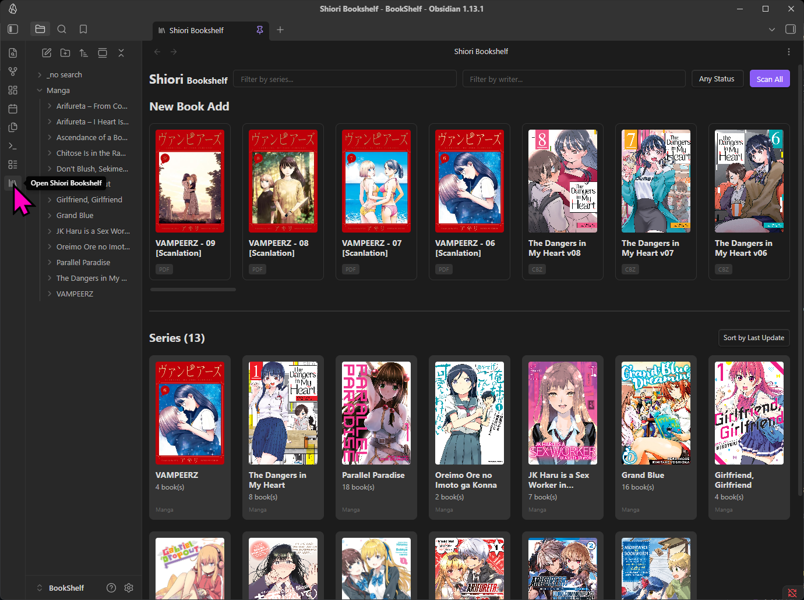
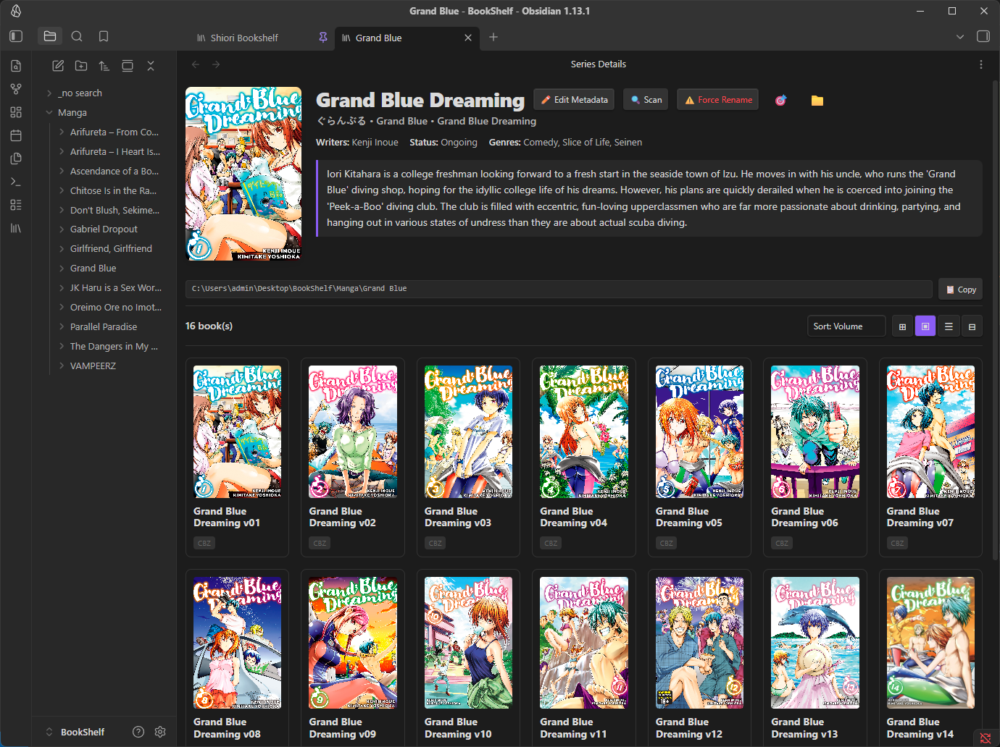
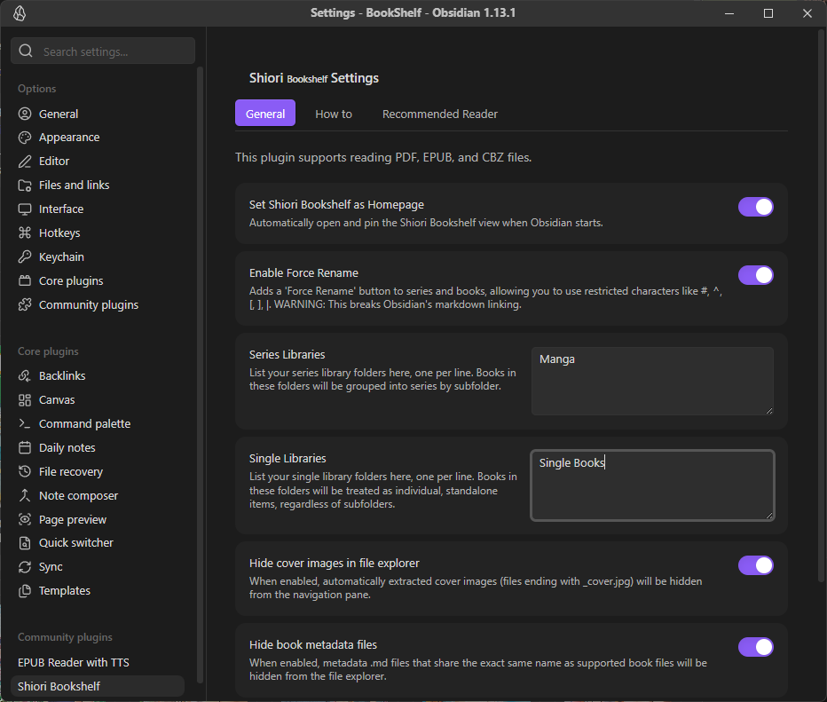

# Shiori Bookshelf

Shiori Bookshelf is a powerful Obsidian plugin that transforms your vault into a beautiful, fully-featured digital library. It allows you to organize, browse your PDF, EPUB, and CBZ files natively inside Obsidian, complete with automatic cover extraction and metadata management.

## ✨ Features

- **Library Organization:**
  - **Series Libraries:** Automatically group books into series based on their subfolders.
  - **Single Libraries:** Manage standalone books independently, regardless of folder structure.
- **Beautiful Bookshelf View:**
  - A visually rich, grid-based gallery view displaying your books and series covers.
  - Search by Title or Writer.
  - Filter by reading status (*All*, *Read*, *Unread*, *Reading*).
  - Automatically sorts series by the last updated book.
  - Lazy loading with infinite scroll (loads 50 items at a time for optimal performance).
- **Automated Metadata & Covers:**
  - Automatically extracts cover images (`_cover.jpg`) from your book files.
  - Automatically generates a companion markdown (`.md`) file for each book to store reading status, writer, and title.
- **Context Menu Integration:**
  - **Add to Libraries:** Quickly add folders to your Series or Single libraries via right-click.
  - **Scan:** Manually trigger cover extraction for all books inside a folder.
  - **Open Metadata file:** Quickly jump to the hidden `.md` metadata file of any book to edit its properties.
  - **Force Rename:** Bypass Obsidian's restrictive character limits to rename files using characters like `#`, `^`, `[`, `]`, `|`. Automatically syncs the new name to the companion metadata and cover files.
- **Clean File Explorer:**
  - Options in settings to automatically hide the extracted `_cover.jpg` and metadata `.md` files from your Obsidian file explorer to keep your workspace clutter-free.

## 🚀 Installation

*Note: This plugin is currently in development and can be installed manually.*

1. Download the latest release from the GitHub repository.
2. Extract the contents (`main.js`, `manifest.json`, `styles.css`) into your Obsidian vault's plugin directory: `[Vault]/.obsidian/plugins/obsidian-plugins-shiori-bookshelf/`.
3. Open Obsidian Settings -> **Community Plugins**.
4. Refresh the plugin list and enable **Shiori Bookshelf**.

## 📖 Documentation & Guides

For detailed, step-by-step instructions on how to use specific features, please refer to the following guides:

- [How to Setup Libraries](how_to_setup_libraries.md)
- [How to Use the Bookshelf View](how_to_use_bookshelf_view.md)
- [How to Manage Metadata and Covers](how_to_manage_metadata_and_covers.md)
- [How to Use Force Rename](how_to_use_force_rename.md)

## 📦 Release Notes

### v1.0.1
- **File Size in List View:** The Bookshelf List view now displays the file size next to the file extension.
- **Remember View State:** Your preferred view mode (Thumbnail, List, Detail, etc.), sort order, and filter settings are now automatically saved and remembered across sessions.
- **✨ Gemini Auto Fill:** Added an "Auto Fill" button to the Edit Metadata window. You can now automatically fetch and fill series metadata (including Japanese/English/Romaji aliases, summary, writers, publisher, genres, tags, and age rating) using Google's Gemini AI. 
- **Gemini Settings:** Added settings for "Gemini API Key" and "Gemini Model" to support the new Auto Fill feature.

### v1.0.2
- **Unified Context Menu:** The right-click context menu (Open in new window, Force Rename, Delete, etc.) is now available across all view modes (Card, Thumbnail, List, and Detail View).
- **Advance Filters:** Added a new "Advance Filter" toggle in the home bookshelf to easily show/hide filter categories.
- **Library Filtering:** Added the ability to filter series by "Libraries" (your setup folders) alongside Genres and Tags.
- **Improved Filter Organization:** Filter sections are now reordered to Libraries, Genres, and Tags, and are expanded by default when you click the Advance Filter button.
- **Reset Filters Button:** Added a convenient "Reset Filters" button to instantly clear all selected filters across all categories.
- **Thumbnail Zoom:** Added zoom controls (`-`, `reset`, `+`) for the Thumbnail view, allowing you to easily resize book covers.

### v1.0.3
- **Series Context Menu:** Added a right-click context menu to Series cards, bringing feature parity with book cards. You can now easily perform actions like Open in new window, Copy path, Show in system explorer, Reveal in navigation, Regenerate Cover (for all books in the series), Open Metadata file, Force Rename, and Delete directly from the series folder.
- **Fixed How To Tab:** Fixed an issue where the "How To" instructions in the settings tab would disappear when the plugin was downloaded/installed via the community plugins directory. Instructions are now bundled directly within the plugin.

## ❤️ Support & Donate

If this plugin has improved your Obsidian workflow, saved you time, or you just want to support its continued development, please consider donating! 

Your support is incredibly appreciated, helps fix bugs, and keeps this project alive and growing. 🙏

https://buymeacoffee.com/endofday

---
**Built with ❤️ for the Obsidian Community**
